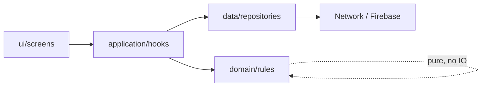
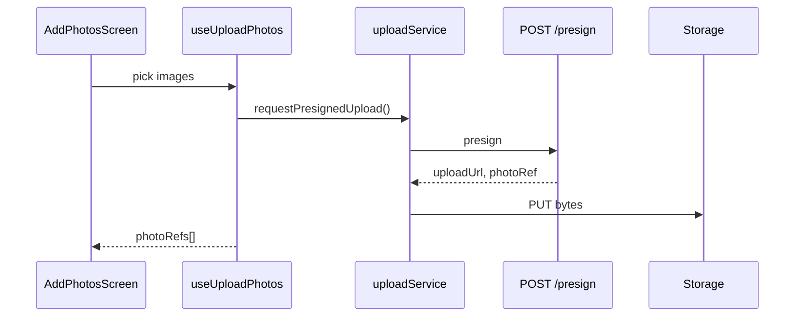
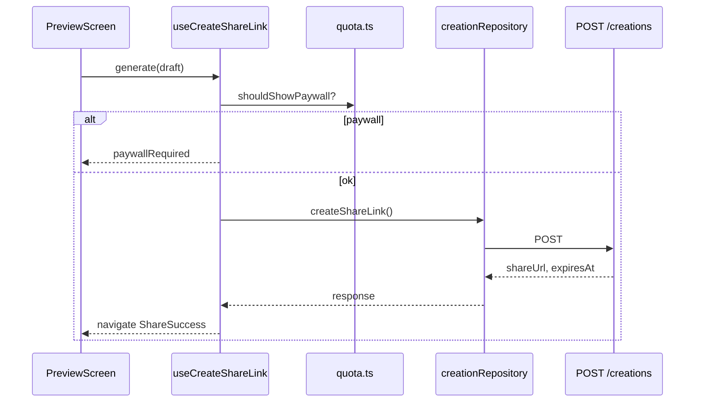

Agents: follow this flow **every time**. No `fetch` in screens. No Firestore in `ui/`.

---

## 1. Layer flow (mandatory)



| Layer | May call | Must NOT |
|---|---|---|
| **ui** | `application` hooks, `domain` types for display | `fetch`, Firebase, RevenueCat |
| **application** | `domain`, `data` | JSX, StyleSheet |
| **domain** | nothing external | React, fetch, Firebase |
| **data** | `domain`, `shared/config` | React, `ui/` |

**Example (create):**
```
PreviewScreen → useCreateShareLink() → quota.ts + creationRepository.ts → fetch / mock
```

---

## 2. Where each kind of data lives

| Data kind | Storage | Access layer |
|---|---|---|
| Create wizard draft | React state / context (`useCreateDraft`) | `application/` |
| Auth session | Firebase Auth → application auth module | `features/auth/data/` |
| User profile, vault, history | Firestore | `features/*/data/` + listeners in hooks |
| Card media bytes | **Base64 interim** (Spark, 1 photo) → **Firebase Storage** (Blaze) → R2 at scale | `photoRefs.ts` / `base64MediaService.ts` or `storageService.ts` |
| Share link record | Firestore `creations` | `POST /v1/creations` (Function) |
| Subscription entitlement | RevenueCat + Firestore mirror | `features/billing/data/` |
| Public card view | Read-only API | `GET /v1/cards/:slug` (recipient web) |

**Spark interim:** one compressed photo as `data:image/...` in Firestore `mediaUrls` when `useBase64Media: true` (~750 KB cap).  
**Target:** Firebase Storage paths / HTTPS URLs only — never multi-photo base64.

---

## 3. Network boundaries

### Client → server (HTTPS Functions)

| Endpoint | Caller | Auth |
|---|---|---|
| `POST /v1/uploads/presign` | `uploadService.ts` | Optional guest |
| `POST /v1/creations` | `creationRepository.ts` | Optional guest |
| `GET /v1/cards/:slug` | recipient web | Public |
| `POST /v1/scheduled-sends/:id/approve` | vault data | Required |
| RevenueCat webhook | server only | N/A |

Full schemas: [api-contracts.md](./api-contracts.md)

### Client → Firestore (direct)

Allowed for **reads** and **user-owned writes** where security rules permit.  
**Privileged writes** (create public slug, dispatch send, billing) → **Functions only**.

### Config

- `src/shared/config/env.ts` — `getApiBaseUrl()`, `shareBaseUrl`, `useMockApi`, `useFunctionsEmulator`
- `src/shared/api/httpClient.ts` — all repositories use this (not raw `fetch` for API)
- Secrets: server only (see [env-strategy.md](./env-strategy.md))
- Local dev: `npm run functions:serve` then `useFunctionsEmulator: true` (default in `__DEV__`)

---

## 4. API call pattern (data layer)

Every repository function should:

1. Validate inputs (or rely on domain rules called by application layer)
2. Call network with typed request/response
3. Map HTTP status → typed `*ApiError` with `code`
4. **Never** return raw `fetch` Response to UI

```typescript
// data/creationRepository.ts — pattern
import { getApiBaseUrl } from '../../../shared/config/env';
import { httpClient } from '../../../shared/api/httpClient';

export async function createShareLink(...): Promise<CreateCreationResponse> {
  if (env.useMockApi) return mockCreation(...);
  return httpClient.post(getApiBaseUrl(), '/v1/creations', { ... });
}
```

**Error codes** (handle in `application/`):  
`VALIDATION_ERROR` · `QUOTA_EXCEEDED` · `UPLOAD_MISSING` · `NOT_FOUND` · `EXPIRED` · `INTERNAL`

---

## 5. Application hooks (orchestration)

Hooks bridge UI and data. They:

- Hold `isLoading`, `error`, `result` state
- Call domain rules **before** network (e.g. `shouldShowPaywall`, `canPreviewDraft`)
- Map errors to user-facing strings
- Expose imperative actions (`generate()`, `save()`, `refresh()`)

```typescript
// application/useCreateShareLink.ts — pattern
// 1. domain check → 2. data call → 3. set state → 4. return result
```

UI calls **one hook** per screen concern — not five repositories.

---

## 6. Upload flow (photos)



Photo refs (strings) go into draft → `createShareLink(draft, photoRefs)`.

---

## 7. Create → share flow



---

## 8. Realtime vs request/response

| Use | Pattern |
|---|---|
| Vault list, history | Firestore `onSnapshot` in `data/`; hook exposes array + loading |
| One-off actions (create, approve send) | `fetch` POST in `data/`; hook awaits |
| Auth state | Firebase `onAuthStateChanged` in `auth/application/` |

Don't mix: screens shouldn't subscribe to Firestore directly.

---

## 9. Caching & offline

| v1 policy | Rule |
|---|---|
| Create draft | Local state only; lost on kill — acceptable for v1 |
| Vault / history | Firestore cache default; show stale + refresh |
| Share / upload | **Requires network**; show clear offline error |
| Auto-send | Server-side only |

No offline-first sync engine in MVP.

---

## 10. Analytics (fire from application layer)

After successful domain action, not from `data/`:

`card_shared` · `upload_failed` · `vault_person_added` · etc.

---

## 11. Agent checklist (before adding API/data code)

- [ ] New IO in `data/` only — not in `ui/` or `domain/`
- [ ] Typed request/response + `*ApiError`
- [ ] Domain rules tested without network
- [ ] Hook exposes loading/error to UI
- [ ] Document new endpoints in `api-contracts.md`
- [ ] Mock path for `__DEV__` when backend not ready
- [ ] No secrets in client
