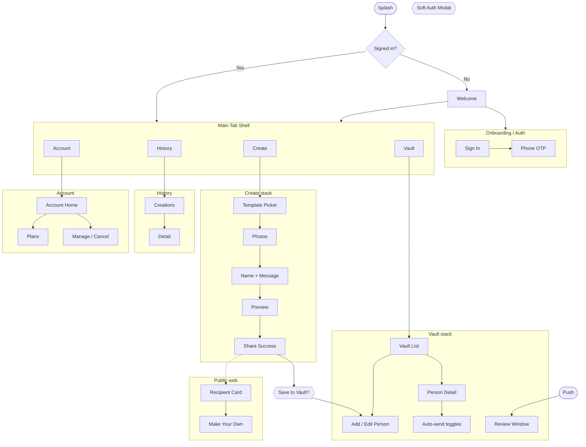

## Navigation assumptions

- **Guest** can finish Create → Share without signing in
- **Soft auth** gates Vault save, auto-send, synced History, subscription
- **4 tabs:** Create · Vault · History · Account

### Pattern legend

| Pattern | Meaning |
|---|---|
| Tab | Root destination |
| Push | Full-screen stack |
| Modal | Sheet/dialog over current screen |
| Deep link / FCM | External entry |

## Site map



## Hierarchy

```
App
├── Splash / Welcome / Auth
├── Tab Shell
│   ├── Create → Template → Photos → Details → Preview → Share
│   ├── Vault → List → Detail / Add → Auto-send (+ Review via FCM)
│   ├── History → Detail
│   └── Account → Plans / Manage / Privacy / Settings
└── Web Recipient → Card → CTA
```

Full screen tables (purpose, entry, exit) live in conversation history and should be expanded here during the wireframe pass — this page is the structural spine.
