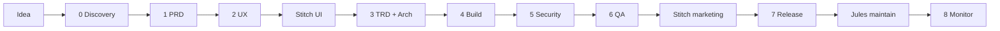

Your pipeline in plain language. **Occasio = mobile app first**; docs-site holds the records.



## The 3 things every project must have

| # | What | Occasio file |
|---|---|---|
| 1 | **What we're building** | `docs-site/content/prd.md` |
| 2 | **How we build it** | `ARCHITECTURE.md` + `AGENTS.md` |
| 3 | **Where code goes** | `src/features/` (mobile) |

Everything else supports these three.

## Phase cheat sheet

| Phase | Remember as | Important? | Occasio status |
|---|---|---|---|
| **0 Discovery** | "Is this worth building?" | **Must** — 1 page | ✅ Done |
| **1 PRD** | "What exactly?" | **Must** | ✅ Done |
| **2 UX** | "Can users get through it?" | **Must** — flows + wireframes | ✅ Wireframes; usability optional |
| **Stitch UI** | "What does it look like?" | **Should** — before polish | 🟡 Tokens done; you run Stitch |
| **3 TRD + Arch** | "How does the system work?" | **Must** for solo+AI | ✅ Done + foundation hardening |
| **4 Build** | "Ship slices" | **Must** — the product | 🟡 Create in progress |
| **5 Security** | "Don't leak data" | **Must** before real users | ❌ With auth/billing |
| **6 QA** | "Does it break?" | **Must** before store | ❌ Later |
| **Stitch marketing** | "Store looks honest" | **Should** at launch | ❌ After real screens |
| **7 Release** | "Get it out" | **Must** | ❌ Later |
| **Jules** | "Don't rot" | **Nice** — chores only | ❌ After CI + code |
| **8 Monitor** | "Did it work?" | **Must** day 1 of beta | ❌ With beta |

## Important vs not (solo dev)

### Always do (small, written down)

- 1-page discovery + PRD with **non-goals**
- Wireframes (ASCII is fine)
- `ARCHITECTURE.md` + `AGENTS.md` + `.cursor/rules/`
- Feature folders: `ui / application / domain / data`
- One feature at a time
- Design tokens in one file

### Do when you have users / money / PII

- Full usability lab (3–5 people is enough early)
- Security audit, DPDP, store privacy forms
- E2E tests (only critical paths)
- Jules for dep bumps

### Skip or defer (keeps you sane)

- Full Clean Architecture monorepo
- Microservices
- Perfect Figma before first working screen
- Testing every screen
- docs-site as the product app
- Video templates in v1

## Scalable but simple architecture (remember this)

```
Screen  →  Hook (application)  →  Rules (domain)  →  API (data)
```

- **domain** = pure rules (easy to test)
- **data** = Firebase, fetch, upload (swap later without touching UI)
- **ui** = dumb screens

Add features = add folders under `src/features/`, not new apps.

## What we added for AI IDE solo dev

| File | Why |
|---|---|
| `AGENTS.md` | Tells AI the whole project story |
| `.cursor/rules/` | Auto-enforces layers per folder |
| `design-tokens.json` | One visual source |
| `.env.example` | Secrets pattern |
| `docs-site/content/blueprint.md` | Phase checklist |
| `.github/workflows/ci.yml` | Catches breaks early |

## Your mantra

**Think wide in docs, build narrow in code.**

One feature slice → ship → measure → next slice.
