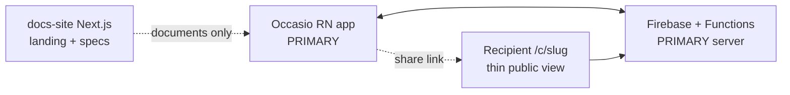

## Principle

**Occasio = React Native mobile app.** The docs site explains and tracks the product; it does not replace the app.

## Surfaces

| Surface | Repo path | Ships to users? | Build priority |
|---|---|---|---|
| **Mobile app** | `/src`, `App.tsx`, `android/`, `ios/` | Yes — main product | **#1 always** |
| **Backend** | Functions (future `functions/`) | Yes — invisible | **#1 with mobile** |
| **docs-site** | `/docs-site` | Optional public docs/landing | When you want a website |
| **Recipient web** | `docs-site` route or tiny Next app later | Yes — share links | After create flow works |

## What docs-site is for

- PRD, TRD, blueprint, IA, wireframes, API contracts
- Team/you: read and update specs
- Optional: marketing landing page at deploy time
- **Not** the creator flow, vault, or billing UI

## What the mobile app owns

| Epic | Mobile feature folder |
|---|---|
| Create & share | `src/features/create/` |
| Auth | `src/features/auth/` (future) |
| Vault | `src/features/vault/` |
| History | `src/features/history/` |
| Billing | `src/features/billing/` |
| Review window | `src/features/vault/` |

## Planning rule

When a blueprint item says “build X”:

1. Implement in **`src/features/`** (mobile) unless explicitly “recipient web” or “Functions”
2. Update **`docs-site/content/`** only to record the decision or API contract
3. Do not duplicate product UI in docs-site

## Mobile-first build phases (engineering)

| Phase | Mobile work | Docs-site work |
|---|---|---|
| Foundation | ESLint boundaries, tokens, navigation | Already done — reference only |
| Create | Upload, share link, share sheet | Update create-blueprint status |
| Recipient | — | Optional `/c/[slug]` page OR separate minimal deploy |
| Auth/Vault | Screens + Firestore | API contract doc |
| Billing | RevenueCat + paywall | — |
| Auto-send | Review UI + FCM | TRD cron (Functions repo) |

See repo root [`ARCHITECTURE.md`](../../ARCHITECTURE.md) for the developer quick reference.
