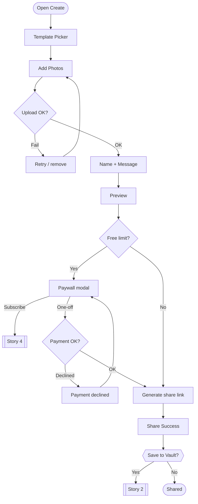
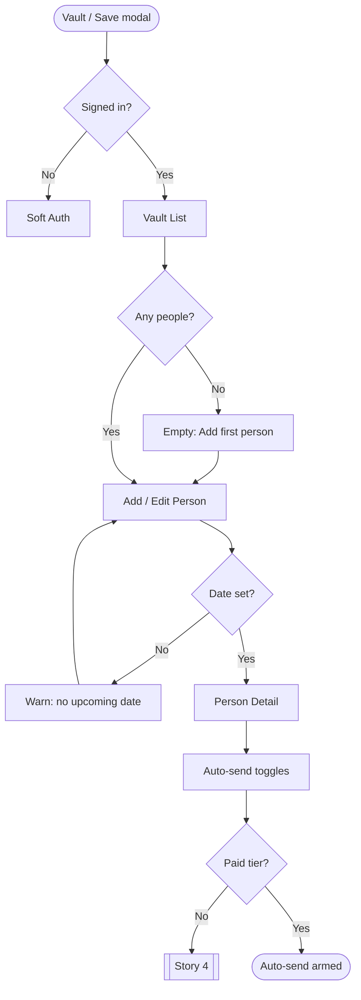
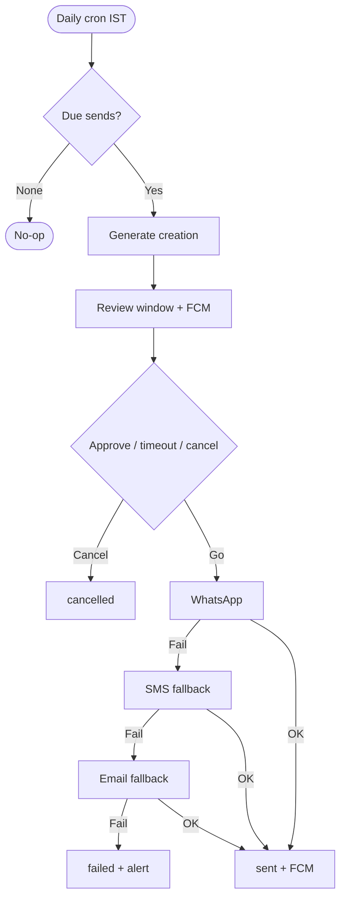
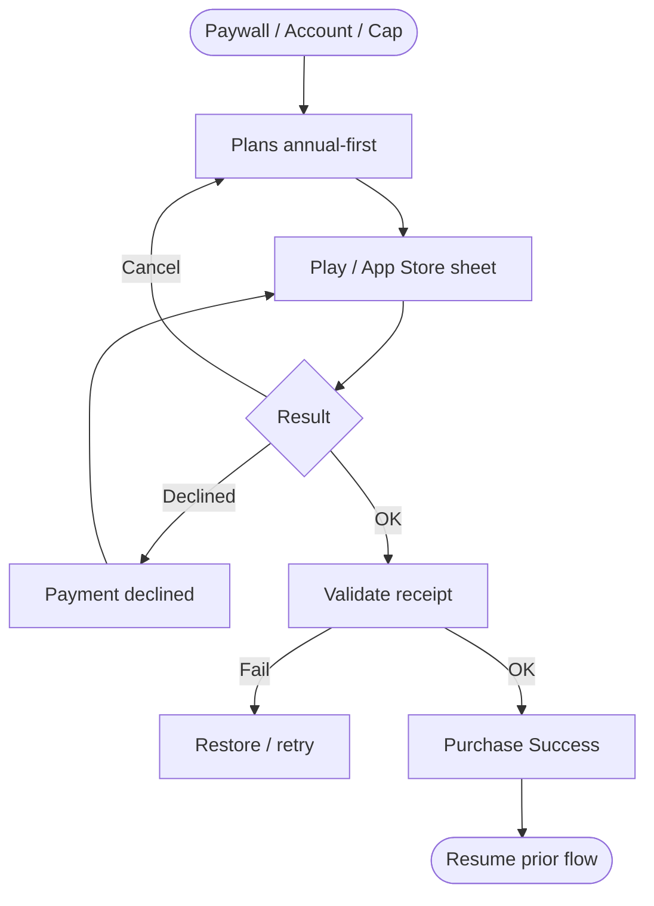
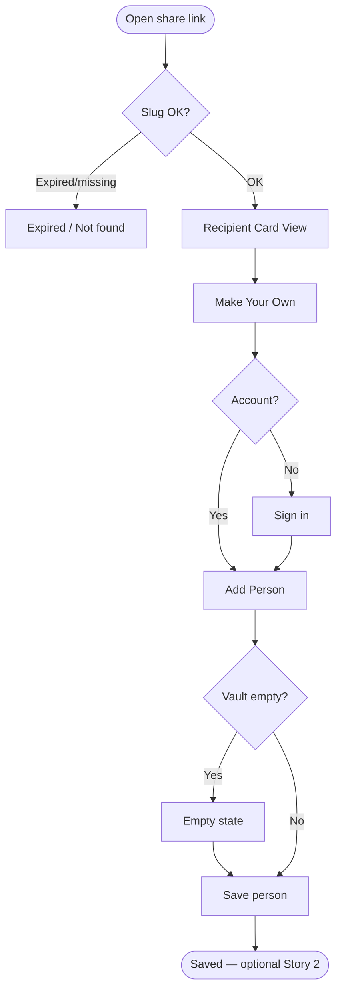

## 1) Create and share a card

## 2) Add person to Vault + enable auto-send

## 3) Auto-send on schedule

## 4) Subscribe

## 5) Recipient opens card → own Vault

## Cross-links

| From | Branch | To |
|---|---|---|
| 1 | Subscribe / one-off | 4 |
| 1 | Save to Vault | 2 |
| 2 | Cap / auto-send gate | 4 |
| 3 | Delivery link | 5 |
| 5 | Make your own | 1 |
